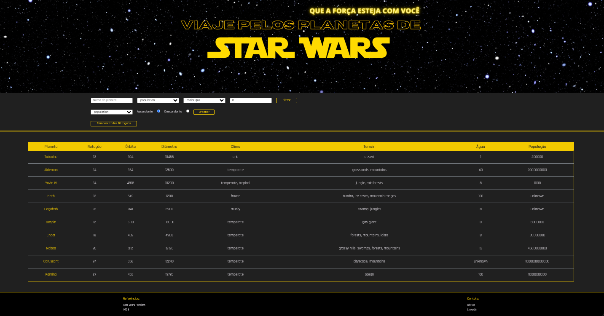

#   Star Wars Search

Este é um site desenvolvido enquanto estava cursando a Trybe(Full Stack), para explorar informações sobre os planetas da saga Star Wars. Adicionei a função que ao selecionar um planeta, você terá acesso a detalhes sobre ele, incluindo capas de filmes, séries e animações relacionadas. Ao escolher um filme, será exibido o trailer, capa e sinopse.

O objetivo deste projeto foi praticar habilidades em CSS, e a escolha do universo Star Wars foi motivada pela riqueza de informações e meu interesse pessoal nesse universo.

##  
 Deploy:
- [link: Star Wars Search](star-wars-search-rho.vercel.app)

##    Stacks Utilizada:

  - CSS
  - React
  - Context API
  - React Hooks

##   Instalação:

  ‣ Clone o repositório: git clone git@github.com:LiliBertolaccini/StarWars_search.git

  ‣ Instale as dependências: npm install
  
  ‣ Inicie a aplicação: npm start

##  Agradecimentos e colaboração:
[Karla Oshikawa](https://github.com/karlaoshikawa)

##   Contato:

##  Referências:

- [IMDb](https://www.imdb.com/)

- [Star Wars Fandom](https://starwars.fandom.com/pt/wiki/P%C3%A1gina_principal)
